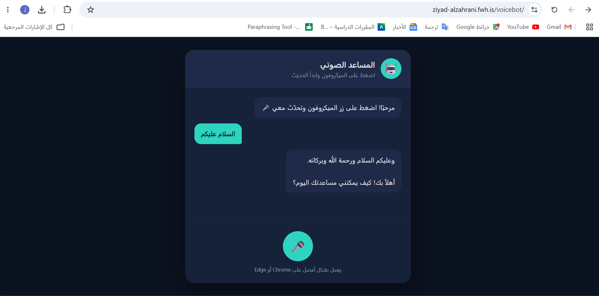

# Arabic Voice Assistant — Debugging and Deployment Task

## Project Background

The original Arabic voice assistant project was provided by the engineer/instructor.

My task was **not to build the project from the beginning**. My role was to identify the hidden errors, fix the deployment problems, and make the project work correctly on InfinityFree hosting.

## My Work on the Project

I made the following changes and fixes:

### 1. Fixed the reserved `chat` filename problem

InfinityFree did not allow the project to work correctly when the backend file used the name:

```text
chat.php
```

I changed it to:

```text
gemini-api.php
```

I also updated the JavaScript request path so it sends requests to the new filename.

### 2. Prevented conflicts with existing website files

The hosting account already contained files such as:

```text
index.html
style.css
config.php
```

Uploading the chatbot files directly could replace or damage the existing website.

To solve this, I placed the chatbot inside a separate folder:

```text
/htdocs/voicebot/
```

I also used clearer project-specific filenames:

```text
voicebot.css
voicebot.js
gemini-config.php
gemini-api.php
```

### 3. Corrected all file paths

After renaming the files, I updated the paths inside the project:

- The HTML file now loads `voicebot.css`.
- The HTML file now loads `voicebot.js`.
- The JavaScript file sends requests to `gemini-api.php`.
- The PHP backend loads `gemini-config.php`.

### 4. Fixed the unavailable Gemini model error

The project initially used:

```text
gemini-2.5-flash
```

The API returned an error because this model was not available for the account.

I replaced it with the working model:

```text
gemini-3.5-flash
```

After this change, the assistant successfully received and displayed Arabic responses.

### 5. Protected the Gemini API key

The API key was moved to a separate server-side file:

```text
gemini-config.php
```

For the GitHub version, the real configuration file is excluded using:

```text
.gitignore
```

The repository contains only:

```text
gemini-config.example.php
```

This prevents the private Gemini API key from being published on GitHub.

### 6. Added safer backend error handling

I added validation and clear error messages for cases such as:

- Missing API key
- Missing configuration file
- Empty user input
- Unsupported request method
- Invalid server response
- Gemini API connection failure

### 7. Tested the final project

The final version was tested on InfinityFree.

The completed flow works as follows:

1. The user speaks through the microphone.
2. The browser converts speech to Arabic text.
3. The text is sent to the PHP backend.
4. The backend sends the request to Gemini.
5. Gemini returns an Arabic response.
6. The response appears in the chat and is read aloud.

## Problems and Solutions Summary

| Problem | Solution |
|---|---|
| `chat.php` caused a hosting problem | Renamed it to `gemini-api.php` |
| Existing files had the same names | Used a separate `/voicebot/` folder and unique filenames |
| Renamed files broke the paths | Updated the HTML, JavaScript, and PHP paths |
| Gemini model was unavailable | Changed the model to `gemini-3.5-flash` |
| API key could be exposed on GitHub | Added `.gitignore` and an example configuration file |
| Server errors were unclear | Added validation and readable error messages |

## Live Demo

https://ziad-alzahrani.fwh.is/voicebot/

## Project Files

```text
voicebot/
├── index.html
├── voicebot.css
├── voicebot.js
├── gemini-api.php
├── gemini-config.example.php
├── .htaccess
├── .gitignore
├── README.md
└── images/
    └── demo.png
```

## Setup

1. Copy `gemini-config.example.php`.
2. Rename the copy to:

```text
gemini-config.php
```

3. Add the Gemini API key:

```php
define('GEMINI_API_KEY', 'YOUR_API_KEY');
```

4. Upload the project to a PHP hosting service.
5. Open the project through the website URL.
6. Allow microphone access.

> Do not upload `gemini-config.php` to GitHub because it contains the private API key.

## Technologies Used in the Provided Project

- HTML
- CSS
- JavaScript
- PHP
- Web Speech API
- Gemini API

## Screenshot



## Student

Ziyad Alzahrani
